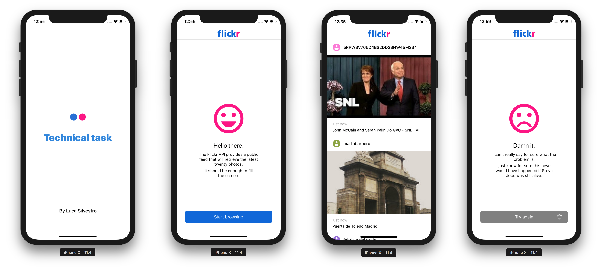

# Flickr Gallery
> iOS Technical assessment

[![Swift Version][swift-image]][swift-url]
[![Build Status][travis-image]][travis-url]
[![License][license-image]][license-url]

We would like you to implement an image gallery application (iOS or Android) that uses the public image Flickr feed as a data source.

## Features

- [x]  Gallery with async image loading and metadata informations 
- [x]  Pull-to-refresh
- [x]  Empty state
- [x]  Viper architecture
- [x]  Modular approach

## To-Dos

- [ ]  Unit tests nearly finished for the Gallery module. Few left to do due to time constraints
- [ ]  Documentation

## Requirements

- Use the most recent tools for the platform of your choice (iOS – Swift/Xcode or Android - Java /Android Studio or Android Java/Kotlin/Android Studio).

- Limit your usage of 3rd party libraries only to the few ones that add a large benefit to the architecture and testability of the project..

- Flickr url that should be used is: https://www.flickr.com/services/feeds/docs/photos_public.

- Image metadata should be visible for each picture

- Git should be used as version control and to track the application development

## Output
- Provide a link to the Github repository with a project.

## References

JSON feed documentation: https://www.flickr.com/services/api/response.json.html

## Frameworks used

- [Alamofire](https://github.com/Alamofire/AlamofireImage)
- [SwiftDate](https://github.com/malcommac/SwiftDate) 

## Meta

Luca Silvestro – [Follow me on Linkedin](https://www.linkedin.com/in/luca-silvestro-49199740/)

[swift-image]:https://img.shields.io/badge/swift-4.0-orange.svg
[swift-url]: https://swift.org/
[license-image]: https://img.shields.io/badge/License-MIT-blue.svg
[license-url]: LICENSE
[travis-image]: https://img.shields.io/travis/dbader/node-datadog-metrics/master.svg?style=flat-square
[travis-url]: https://travis-ci.org/dbader/node-datadog-metrics
[codebeat-image]: https://codebeat.co/badges/c19b47ea-2f9d-45df-8458-b2d952fe9dad
[codebeat-url]: https://codebeat.co/projects/github-com-vsouza-awesomeios-com
